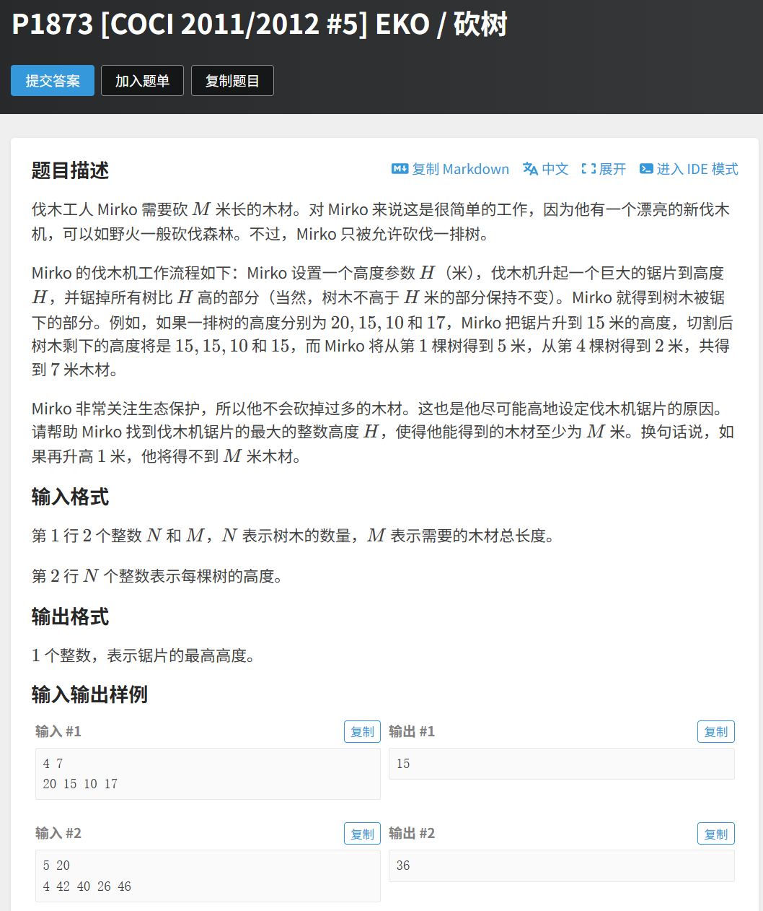

## 题目：


---

## 思路：
二分模板题

---

## 代码：
```cpp
#include<bits/stdc++.h>
using namespace std; 

const int N=1e6+10; 
int a[N], n, m; 

bool check(int mid){
    long long sum; 
    for(int i=1; i<=n; i++){
        if(a[i]>mid) sum+=a[i]-mid; 
    }
    return sum>=m; 
}

int main(){
    ios::sync_with_stdio(0), cin.tie(0);
    
    cin>>n>>m; 
    for(int i=1; i<=n; i++) cin>>a[i]; 
    int ans; 
    
    int l=0, r=4e5+10; 
    while(l<=r){
        int mid=l+(r-l)/2;
        if(check(mid)){
            ans=mid; 
            l=mid+1; 
        }
        else r=mid-1; 
    }
    
    cout<<ans<<'\n'; 
    return 0; 
}
```