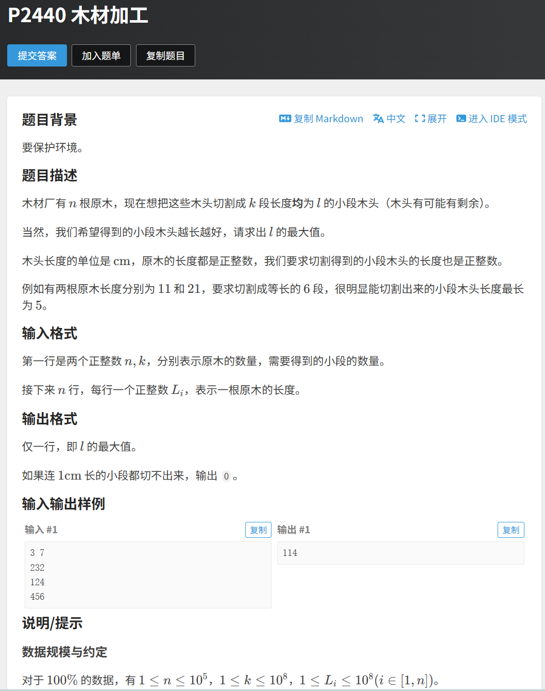

## 题目：


---

## 思路：
二分模板题

---

## 代码：
```CPP
#include<bits/stdc++.h>
using namespace std; 

const int N=1e5+10; 
int a[N], n, k; 

bool check(int mid){
    long long sum=0; 
    if(mid==0) return false;  //鲁棒代码，防止mid为0
    for(int i=1; i<=n; i++){
        sum+=a[i]/mid; 
    }
    return sum>=k; 
}

int main(){
    ios::sync_with_stdio(0), cin.tie(0);
    
    cin>>n>>k; 
    for(int i=1; i<=n; i++) cin>>a[i]; 
    int ans; 
    
    int l=1, r=1e8+10;  //左端点为1，因为至少1cm，且l=1防止mid为0，导致除零错误
    while(l<=r){
        int mid=l+(r-l)/2;
        if(check(mid)){
            ans=mid; 
            l=mid+1; 
        }
        else r=mid-1; 
    }
    
    cout<<ans<<'\n'; 
    return 0; 
}
```

