## 例题：
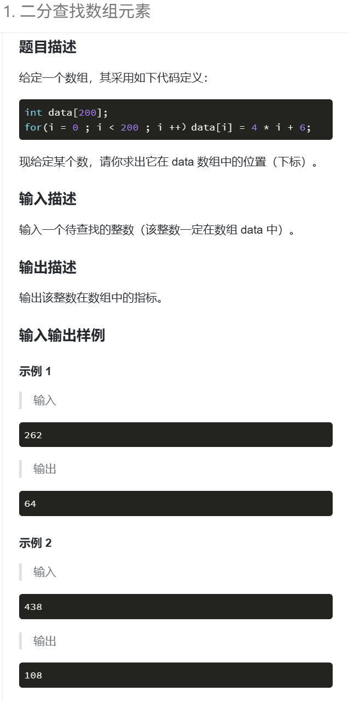

---
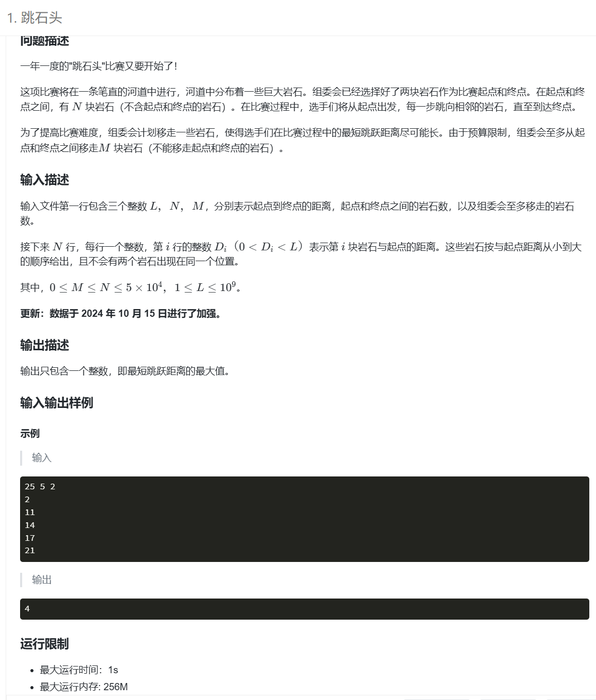

### 思路：
**二分答案法求解跳石头问题的「最大最小跳跃距离」**，核心是通过二分枚举可能的最小跳跃距离，验证该距离是否可通过移除≤M块岩石实现，最终找到满足条件的最大值。

### 步骤拆解
1. **二分范围定义**：左边界`l=0`、右边界`r=1e9+5`，枚举所有可能的最小跳跃距离`mid`；
2. **可行性验证（check函数）**：
   - 以`0`为起点，遍历所有岩石，记录前一个保留的岩石位置`pri`；
   - 若当前岩石与`pri`的距离<`mid`，移除该岩石（计数+1）；否则保留并更新`pri`；
   - 遍历结束后，单独验证最后一块保留岩石到终点`L`的距离，若<`mid`需额外移除；
   - 返回总移除岩石数，若≤M则`mid`可行；
3. **二分更新逻辑**：
   - 若`mid`可行，记录该值并尝试更大距离（`l=mid+1`）；
   - 若不可行，缩小距离（`r=mid-1`）；
4. **结果输出**：循环结束后，记录的`ans`即为满足条件的最大最小跳跃距离。

#### 核心逻辑
「最大化最小值」问题典型解法，通过二分将优化问题转化为O(n)的可行性验证，整体时间复杂度O(nlog⁡1e9)，高效适配数据范围。

---

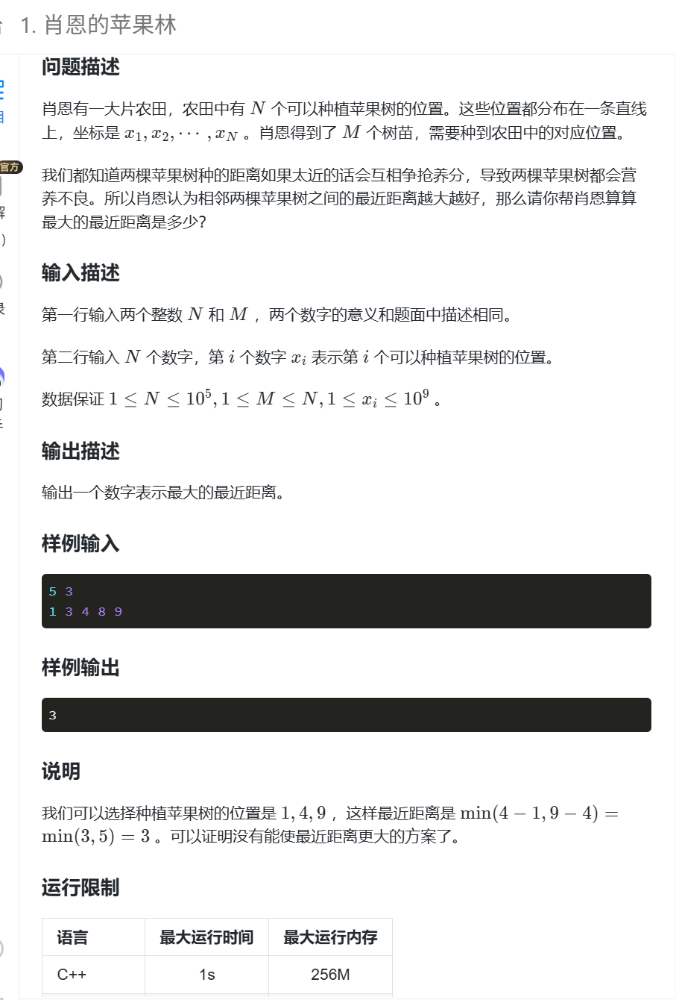

---

### 思路：
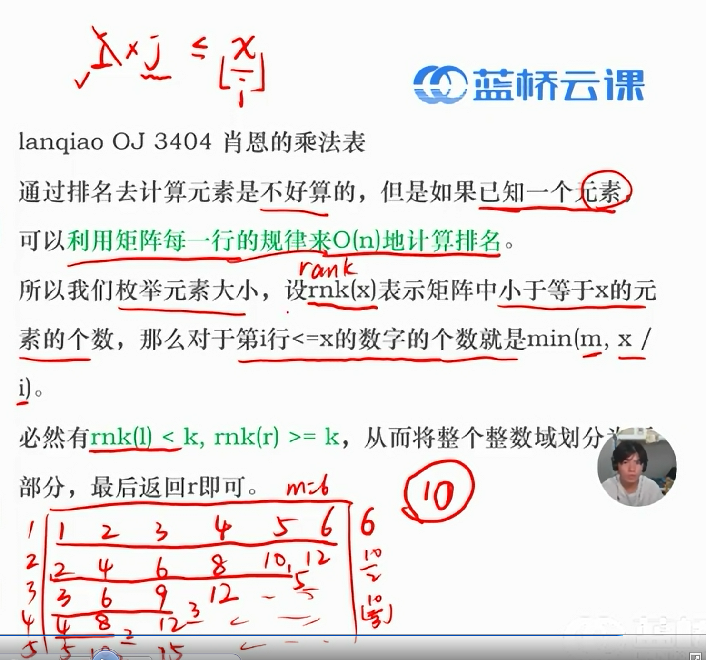

> 数学规律，每行小于x的数量为 min(列数, (x/i)向下取整)
所以，假设第k个数是mid，比较mid的真实排名和k
---

## NOTE:

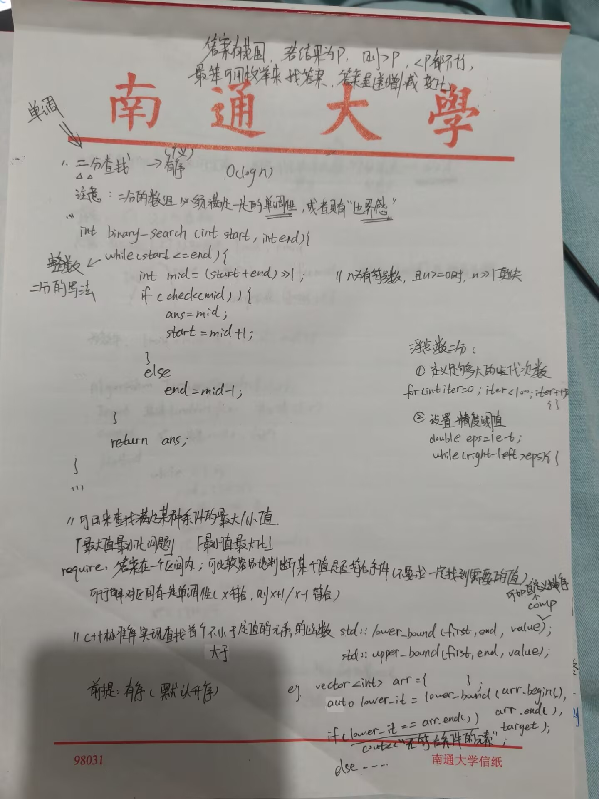
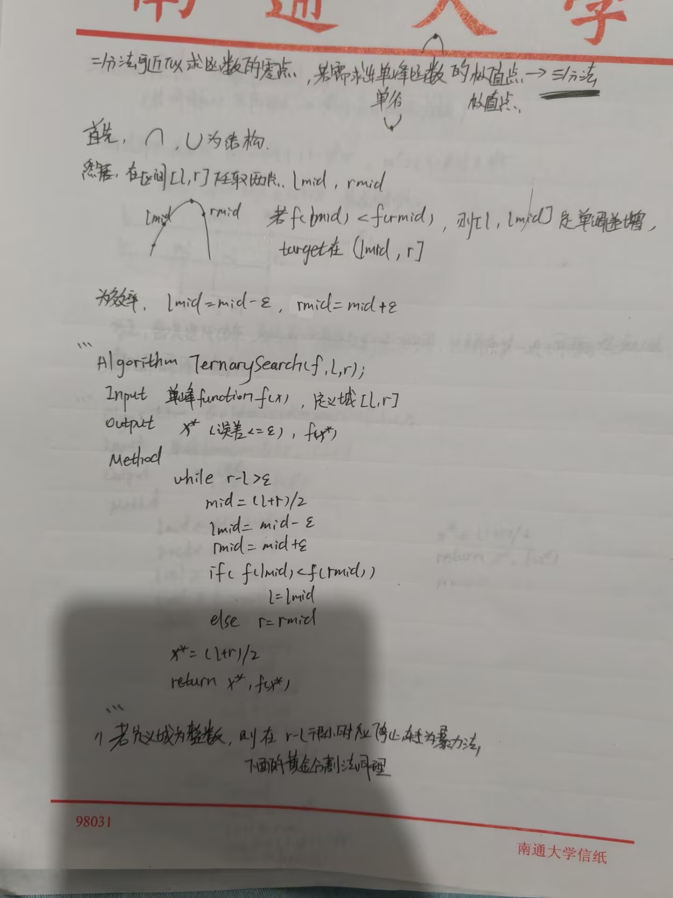
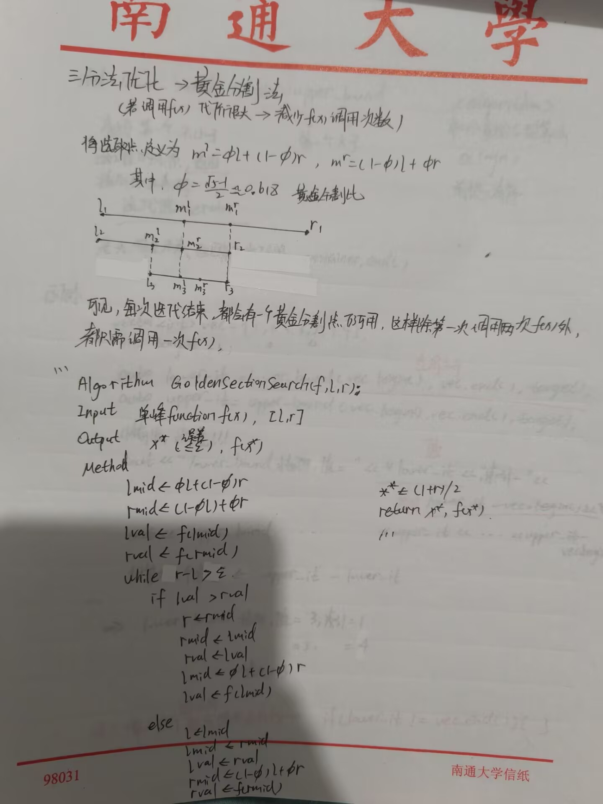
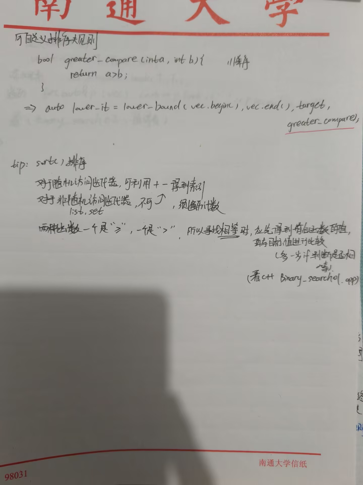
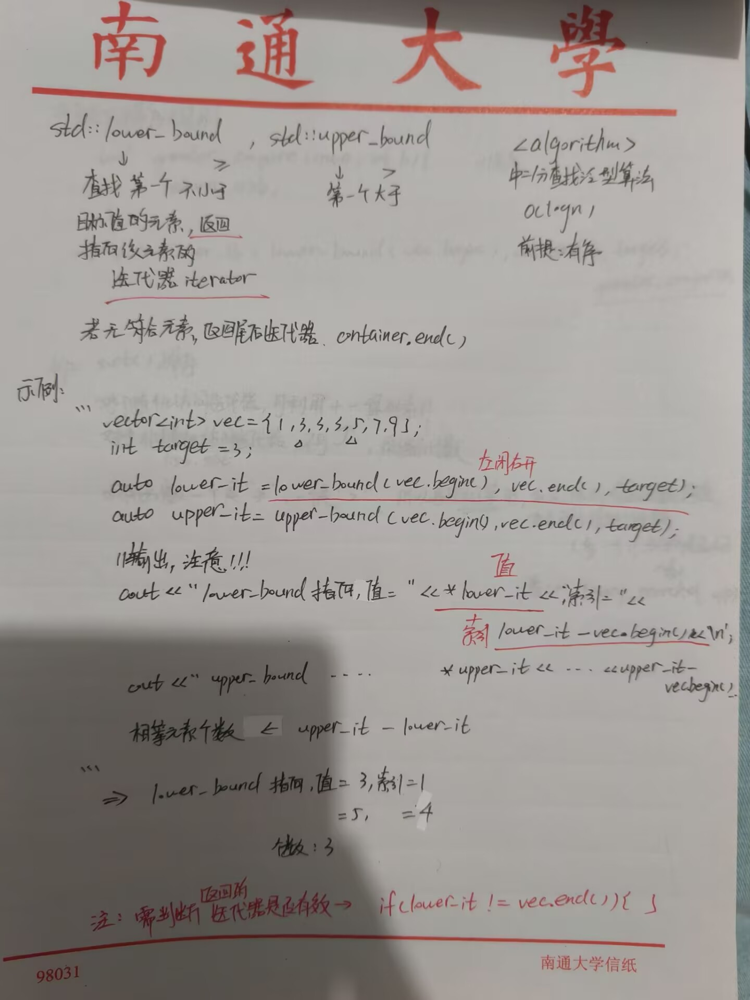
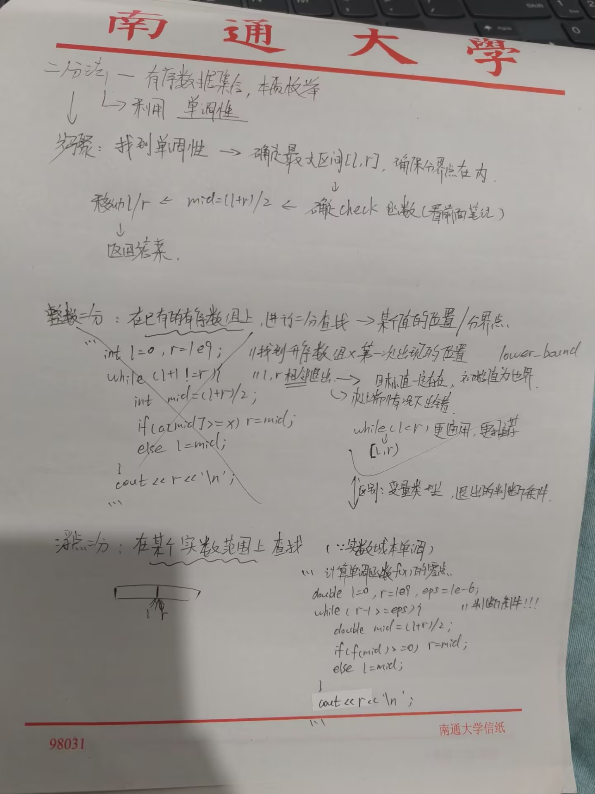
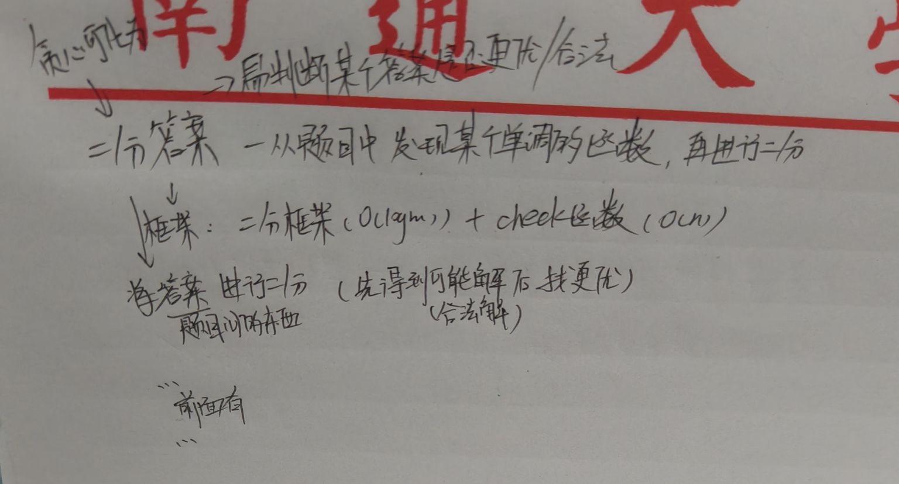
